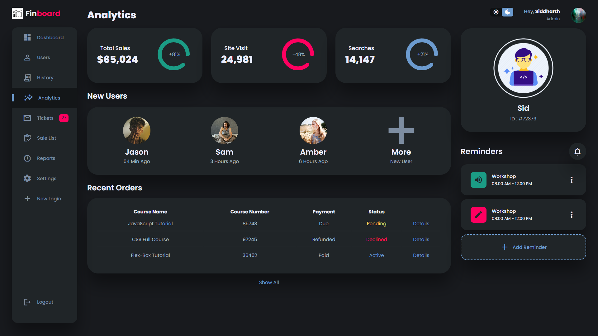
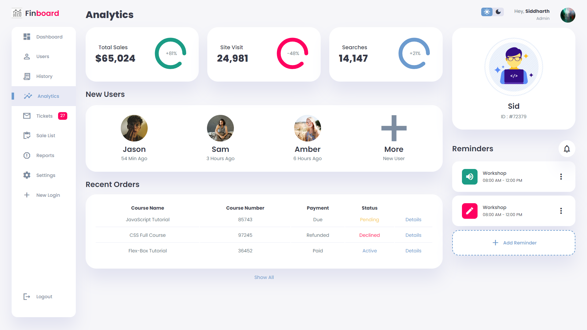

# Administrative Dashboard

Admin dashboard template frontend application for visualization & analytical purposes

## Overview

This project is a responsive web application that includes features such as a side menu, dark mode toggle, and dynamic order status table. The application is built using HTML, CSS, and JavaScript, with a focus on user experience and modern UI practices.

See Live Demo :- https://regal-lamington-7b3bc9.netlify.app/

## Features

- **Responsive Design**: The application is fully responsive, ensuring a seamless experience across devices of all sizes.
- **Dark Mode**: Users can toggle between light and dark mode for a more comfortable viewing experience in different lighting conditions.
- **Side Menu**: A collapsible side menu that can be opened and closed with a button click.
- **Dynamic Order Table**: An interactive table that displays product orders with varying statuses and payment information.

## Screenshots

### Dark Mode


### Light Mode


## Technologies Used

- **HTML5**: Markup language for structuring the web page.
- **CSS3**: Used for styling the web application, including responsive design and theme management.
- **JavaScript**: Handles the interactive elements such as the dark mode toggle, side menu, and dynamic table content.

## Setup Instructions

1. **Clone the Repository**
   ```bash
   git clone https://github.com/Gitkakkar1597/Admin-Dashboard
   ```

2. **Navigate to the Project Directory**
   ```bash
   cd 'project-name'
   ```

3. **Open the `index.html` File in Your Browser**
   - You can open the `index.html` file directly in your web browser to view the application.

## Usage

- **Toggling Dark Mode**: Click on the dark mode button to switch between light and dark themes.
- **Open/Close Side Menu**: Click the menu button to open the side menu and the close button to collapse it.
- **View Orders**: The orders table dynamically displays a list of products with their status and payment details.

## Customization

- **Adding More Orders**: You can add more orders by editing the `orders.js` file. Simply add more objects to the `Orders` array with the desired product details.
- **Modifying the Style**: Adjust the styles in `styles.css` to customize the look and feel of the application.
- **Updating Images**: Replace images in the `/images/` directory with your own assets to change logos, backgrounds, or other visual elements.

## Contributing

If you'd like to contribute to this project, please fork the repository and use a feature branch. Pull requests are warmly welcome.
